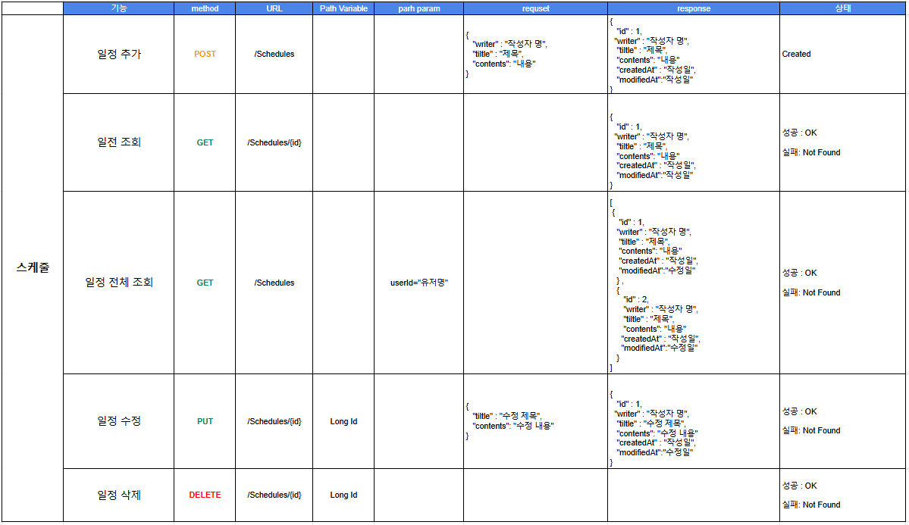
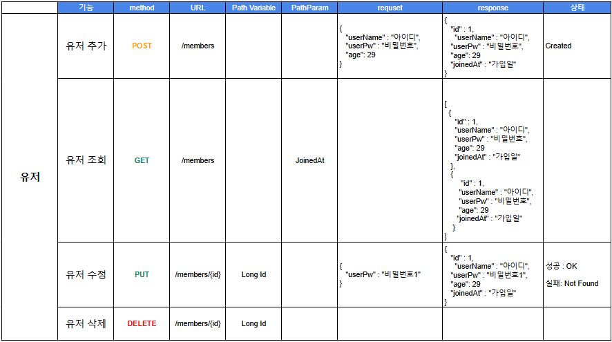
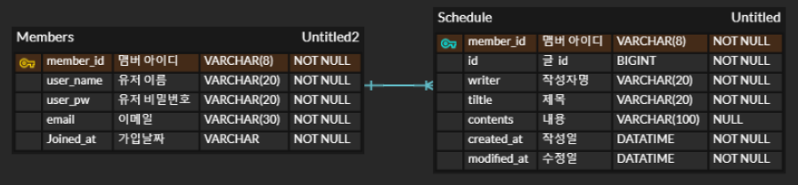

# What for This?

# Schedule API

# User API

# ERD

# DB
  * ScheduleDB

| 칼럼         | 명칭         | 입력 Type   | Null 유무  |
|------------|------------|-----------|----------|
| member_id  | 작성자 number | VARCHAR     | NOT NULL |
| writer     | 작성자        | VARCHAR   | NOT NULL |
| id         | 글 ID       | BIGINT    | NOT NULL |
| title      | 제목         | VARCHAR   | NOT NULL |
| contents   | 내용         | VARCHAR   | NULL     |
| created_at | 작성일        | DATATIME  | NULL     |
| updated_at | 수정일        | DATATIME | NULL     |

  * UserDB

| 칼럼          | 명칭        | 입력 Type     | Null 유무 |
|-------------|-----------|-------------|------|
| member_id   | 작성자 number | VARCHAR     | NOT NULL |
| user_id     | 작성자 id    | VARCHAR     | NOT NULL |
| user_pw     | 작성자 pw    | VARCHAR     | NOT NULL |
| name        | 작성자 이름    | VARCHAR     | NOT NULL |
| email       | 메일주소      | VARCHAR     | NOT NULL |
| age         | 나이        | VARCHAR     | NOT NULL |
| joindate_at | 가입일       | DATATIME   | NOT NULL |

# How Work? 
